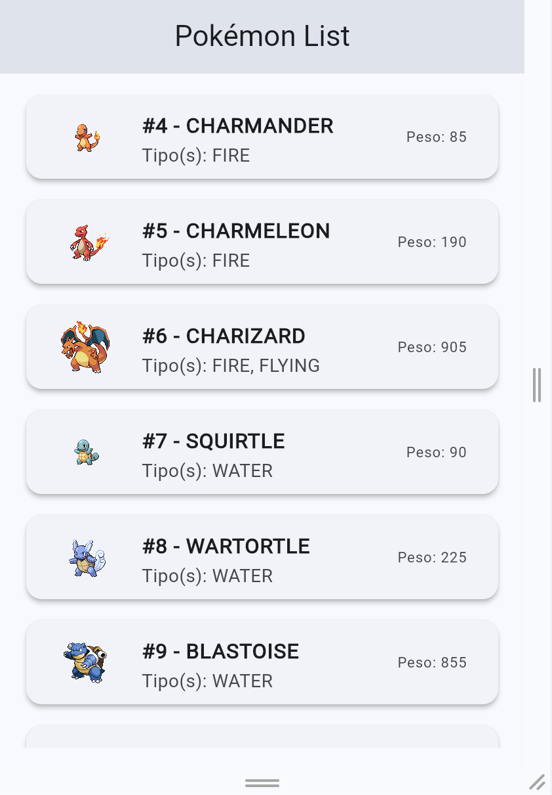

# 🎮 Pokémon API - Infinite Scroll Pagination 

Este proyecto es una aplicación móvil desarrollada en **Flutter** que consume la [PokéAPI](https://pokeapi.co/) para listar criaturas Pokémon. Implementa técnicas avanzadas de renderizado eficiente y consumo de datos bajo demanda para ofrecer una experiencia fluida.

---

## 🚀 Objetivos de la Actividad

### Actividad 1: Mostrar detalles del personaje
Cada tarjeta de la lista realiza una petición secundaria en tiempo real para extraer y renderizar datos específicos de la PokéAPI:
* 📸 Imagen/Sprite oficial en alta calidad.
* 🔢 ID oficial de la Pokédex.
* 🧪 Tipos elementales (ej. GRASS, POISON, FIRE).
* ⚖️ Peso del Pokémon.

### Actividad 2: Infinite Scrolling (Paginación de 5 en 5)
Implementación de scroll infinito utilizando el paquete `infinite_scroll_pagination`. 
* Los Pokémon se cargan de forma asíncrona en bloques estrictos de **5 en 5** conforme el usuario desliza la pantalla hacia abajo.
* Se optimizó el cálculo manual del `offset` en el `PagingController` para evitar solapamientos, desfasajes u ordenamiento duplicado de elementos.

---

## 🛠️ Tecnologías y Paquetes Utilizados

* **Flutter & Dart** (Maquetación y lógica reactiva).
* **HTTP (`package:http`)**: Para el consumo asíncrono de los Endpoints de la API.
* **Infinite Scroll Pagination (`package:infinite_scroll_pagination`)**: Control estricto del estado de la lista, desencadenadores de scroll y carga por demanda.

---

## 🔧 Solución de Desafíos Técnicos

1. **Unbounded Height Error:** Se corrigió el clásico error de Viewport infinito envolviendo la lista paginada dentro de un widget `Expanded`, delimitando así el área de scroll dentro del árbol de componentes de la `Column`.
2. **Control de Duplicados & Null Safety:** Se reestructuró el callback `getNextPageKey` utilizando condicionales de tipo seguros (`?.` / `??`) y un cálculo matemático exacto basado en las llaves previas (`state.keys?.last`) para blindar la paginación contra cargas dobles accidentales.

---

## 📸 Capturas de Pantalla

### Pantalla principal


---

## 🏃‍♂️ Cómo Ejecutar el Proyecto

1. Asegúrate de tener Flutter instalado en tu equipo de manera global.
2. Clona este repositorio:
   ```bash
   git clone [https://github.com/TU_USUARIO/TU_REPOSITORIO.git](https://github.com/TU_USUARIO/TU_REPOSITORIO.git)
   ```
3. Instala las dependencias del proyecto:
   ``` bash
   flutter pub get
   ```
4. Conecta un emulador o dispositivo físico y ejecuta:
   ``` bash
   flutter run
   ```
